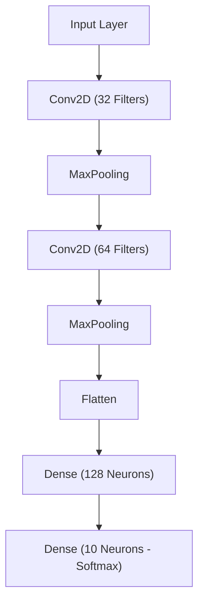

# Handwritten Digit Recognition using CNN

## Project Overview
This project implements a **Convolutional Neural Network (CNN)** to classify handwritten digits using the **MNIST dataset**. The model learns patterns from thousands of handwritten digit images and predicts the correct digit from **0 to 9**.

The project demonstrates the complete deep learning workflow including **data preprocessing, CNN model building, training, evaluation, and visualization of results**.

---

## Dataset
The project uses the **MNIST dataset**, which is a standard benchmark dataset for image classification tasks.

Dataset characteristics:
- 70,000 grayscale images
- Image size: **28 × 28 pixels**
- 10 classes representing digits **0–9**
- 60,000 training images
- 10,000 testing images

---

## Technologies Used

- Python
- TensorFlow / Keras
- NumPy
- Matplotlib
- Seaborn
- Scikit-learn

---

## Project Workflow

### 1. Import Libraries
Required libraries for deep learning, visualization, and evaluation are imported.

### 2. Load Dataset
The MNIST dataset is loaded directly from Keras.

### 3. Data Visualization
Sample handwritten digits are displayed to understand the dataset.

### 4. Data Preprocessing
Steps include:
- Normalizing pixel values from **0–255 → 0–1**
- Reshaping images to **28 × 28 × 1** for CNN input

### 5. CNN Model Architecture
The CNN model consists of:

- Convolution Layers
- MaxPooling Layers
- Fully Connected Dense Layers
- Softmax Output Layer

The model learns spatial features such as edges and shapes of digits.

### 6. Model Training
The model is trained using the **Adam optimizer** and **Sparse Categorical Crossentropy loss function**.

### 7. Model Evaluation
The trained model is evaluated on test data to measure its accuracy.

### 8. Visualization
The project includes multiple visualizations:
- Training vs Validation Accuracy
- Training vs Validation Loss
- Confusion Matrix
- Prediction vs Actual comparison

---

## Model Architecture

---

## Results

- Test Accuracy: **~98–99%**
- The model correctly classifies most handwritten digits.

### Confusion Matrix
A confusion matrix is used to visualize the classification performance of the model across all digit classes.

### Prediction vs Actual
Several test images are displayed with their **actual and predicted labels** to demonstrate model performance.

---

## Output Visualizations

The project generates the following plots:

- Model Accuracy Graph
- Model Loss Graph
- Confusion Matrix Heatmap
- Prediction vs Actual Image Grid

---

## How to Run the Project

1. Clone the repository

```

git clone https://github.com/iRahmanG/Handwritten-Digit-Recognition-MNIST-.git

```

2. Install dependencies

```

pip install tensorflow numpy matplotlib seaborn scikit-learn

```

3. Run the notebook or Python script.

---

## Applications
Handwritten digit recognition is used in:

- Bank cheque processing
- Postal code recognition
- Automated form reading
- Document digitization

---

## Future Improvements

Possible improvements include:

- Adding **Data Augmentation**
- Implementing **Dropout and Batch Normalization**
- Using deeper CNN architectures
- Applying **Grad-CAM visualization**
- Deploying the model as a **web application**

---

## Conclusion
This project demonstrates how **Convolutional Neural Networks (CNNs)** can effectively perform image classification tasks. Using the MNIST dataset, the model achieves high accuracy and provides insights into deep learning-based image recognition systems.
